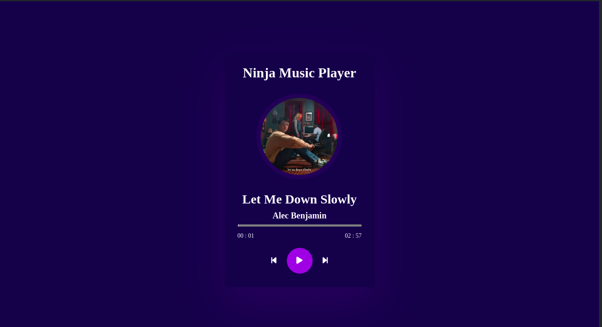

## **Music Player**

Music Player is a dynamic and visually engaging music player built with HTML, CSS, and JavaScript. It features an intuitive interface, dynamic track updates, and essential playback controls.

### **Features**

#### **Music Player Interface**

- A visually appealing design with smooth animations for a lively experience.
- Responsive layout for seamless usage on various devices.
- Animated transitions when switching between tracks using skip buttons.

#### **Track Details**

- Displays the track's title, artist's name, and a cover image.
- Dynamically updates details as the track changes.

```javascript
tracks = [
  {
    name: "Let me down slowly",
    artist: "Alec Benjamin",
    cover: "alec.jpg",
    source: "Let me down slowly.mp3",
  },
  {
    name: "Let me love you",
    artist: "DJ Snake/Justin Beiber",
    cover: "dj.jpg",
    source: "Let me love you.mp3",
  },
  {
    name: "Perfect",
    artist: "Ed Sheeran",
    cover: "ed.jpg",
    source: "Perfect.mp3",
  },
];
```

#### **Progress Bar**

- A functioning progress bar accurately displays the track's progress.
- Users can seek specific parts of a track by clicking on the progress bar.

#### **Playback Controls**

- Includes **play**, **pause**, **skip forward**, and **skip backward** buttons.

#### **Time Display**

- Displays the **current time** and **total duration** of the track.
- Updates dynamically as the track plays.

### **How to Use**

1.  Clone or download the repository.
    ```bash
    https://github.com/Praveen-kumar-DeV/Music-Player.git
    ```
2.  Ensure the file structure includes:

```bash
    - index.html: Main HTML file.
    - script.js: JavaScript for functionality.
    - styles.css: CSS for styling.
    - Supporting directories:

      - ./images/: Contains track cover images.
      - ./songs/: Contains audio files.
```

3.  Open index.html in a browser to launch the player.

### **File Structure**

- **HTML (index.html)**: Defines the structure of the player, including buttons, progress bar, and track details.
- **CSS (styles.css)**: Handles the visual aspects like the layout, colors, and animations.
- **JavaScript (script.js)**: Implements the player functionality, such as dynamic updates and event handling.

### **Screenshots**



## Live Link
[Project Link](https://679b407df0f7d49c206f8799--frabjous-platypus-7668e8.netlify.app/)

### **Developer Notes**

- Ensure audio files (.mp3) and images (.jpg) match the names provided in the track list.
- The player dynamically updates all components when switching tracks or interacting with controls.
